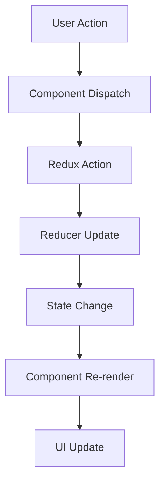

# DermaDetect - Architecture Overview

This document describes the system architecture, design patterns, and technical implementation of the DermaDetect mobile application.

## System Architecture

### High-Level Architecture

```
┌─────────────────┐    ┌─────────────────┐    ┌─────────────────┐
│   Mobile App    │    │   Local DB      │    │   Backend API   │
│   (React Native)│◄──►│   (SQLite)      │◄──►│   (Node.js)     │
│                 │    │                 │    │                 │
│ • UI Components │    │ • Patient Data  │    │ • AI Analysis   │
│ • Navigation    │    │ • Cases         │    │ • User Mgmt     │
│ • State Mgmt    │    │ • Settings      │    │ • Analytics     │
└─────────────────┘    └─────────────────┘    └─────────────────┘
```

### Component Architecture

#### Presentation Layer
- **Screens**: Top-level UI components representing app pages
- **Components**: Reusable UI elements (buttons, modals, forms)
- **Navigation**: Route management and screen transitions

#### Business Logic Layer
- **Services**: API calls, data processing, business rules
- **Store**: State management with Redux Toolkit
- **Database**: Local data persistence with SQLite

#### Data Layer
- **Models**: Data structures and type definitions
- **Schemas**: Database table definitions
- **Migrations**: Database version management

## Core Components

### Navigation System

#### AppNavigator (Root)
```typescript
// Main app navigation with authentication
- LoginScreen (Unauthenticated)
- CHWMain (Authenticated CHW)
- DoctorMain (Authenticated Doctor)
```

#### CHWNavigator (Community Health Worker)
```typescript
// Bottom tab navigation for CHWs
- CHWHome: Dashboard and patient overview
- CHWRegisterPatient: New patient registration
- CHWProfile: User profile and settings access
```

#### DoctorNavigator (Medical Professional)
```typescript
// Bottom tab navigation for doctors
- DoctorDashboard: Case management overview
- DoctorPending: Pending referrals and cases
- DoctorProfile: Professional profile
```

### Component Hierarchy

#### Bottom Sheet Components
- **BaseBottomSheet**: Foundation component for all modals
- **DataEnrichmentBottomSheet**: Symptom and lesion documentation
- **DetailsBottomSheet**: Information display for symptoms/lesions
- **PhotoOptionsBottomSheet**: Camera/gallery selection
- **ConfirmationBottomSheet**: Review and confirm actions
- **TriageResultBottomSheet**: High-risk alerts and actions

#### Screen Components
- **CameraScreen**: Photo capture with advanced controls
- **ResultScreen**: AI analysis display and triage routing
- **Patient Registration**: Multi-step patient onboarding
- **Profile Management**: User and patient profile editing

### State Management

#### Redux Store Structure
```typescript
interface RootState {
  auth: {
    user: User | null;
    isAuthenticated: boolean;
    loading: boolean;
  };
  app: {
    theme: 'light' | 'dark';
    language: string;
    offlineMode: boolean;
  };
  cases: {
    activeCases: Case[];
    pendingReferrals: Referral[];
    completedCases: Case[];
  };
}
```

#### Slice Organization
- **authSlice**: Authentication state and user management
- **appSlice**: Global app settings and preferences
- **casesSlice**: Patient cases and referral management

### Database Schema

#### Core Tables
```sql
-- Users (CHWs and Doctors)
CREATE TABLE users (
  id INTEGER PRIMARY KEY,
  email TEXT UNIQUE NOT NULL,
  password_hash TEXT NOT NULL,
  role TEXT NOT NULL, -- 'CHW' | 'DOCTOR'
  profile_data TEXT, -- JSON profile information
  created_at DATETIME DEFAULT CURRENT_TIMESTAMP
);

-- Patients
CREATE TABLE patients (
  id INTEGER PRIMARY KEY,
  chw_id INTEGER,
  demographics TEXT, -- JSON demographic data
  medical_history TEXT, -- JSON medical history
  contact_info TEXT, -- JSON contact details
  created_at DATETIME DEFAULT CURRENT_TIMESTAMP,
  FOREIGN KEY (chw_id) REFERENCES users(id)
);

-- Cases (Lesion assessments)
CREATE TABLE cases (
  id INTEGER PRIMARY KEY,
  patient_id INTEGER,
  chw_id INTEGER,
  images TEXT, -- JSON array of image URIs
  ai_analysis TEXT, -- JSON AI analysis results
  triage_result TEXT, -- 'low' | 'medium' | 'high'
  status TEXT DEFAULT 'active', -- 'active' | 'referred' | 'completed'
  created_at DATETIME DEFAULT CURRENT_TIMESTAMP,
  FOREIGN KEY (patient_id) REFERENCES patients(id),
  FOREIGN KEY (chw_id) REFERENCES users(id)
);

-- Referrals (Doctor assignments)
CREATE TABLE referrals (
  id INTEGER PRIMARY KEY,
  case_id INTEGER,
  doctor_id INTEGER,
  chw_id INTEGER,
  referral_data TEXT, -- JSON referral information
  status TEXT DEFAULT 'pending', -- 'pending' | 'accepted' | 'completed'
  created_at DATETIME DEFAULT CURRENT_TIMESTAMP,
  FOREIGN KEY (case_id) REFERENCES cases(id),
  FOREIGN KEY (doctor_id) REFERENCES users(id),
  FOREIGN KEY (chw_id) REFERENCES users(id)
);
```

## Key Design Patterns

### Component Patterns

#### Higher-Order Components (HOC)
```typescript
// Authentication wrapper
const withAuth = (Component: React.ComponentType) => {
  return (props: any) => {
    const { isAuthenticated } = useSelector((state: RootState) => state.auth);

    if (!isAuthenticated) {
      return <LoginScreen />;
    }

    return <Component {...props} />;
  };
};
```

#### Custom Hooks
```typescript
// Camera permission hook
const useCameraPermission = () => {
  const [hasPermission, setHasPermission] = useState(false);

  useEffect(() => {
    const requestPermission = async () => {
      const granted = await request(PERMISSIONS.ANDROID.CAMERA);
      setHasPermission(granted === RESULTS.GRANTED);
    };

    requestPermission();
  }, []);

  return hasPermission;
};
```

### Service Layer Pattern

#### API Service Structure
```typescript
class ApiService {
  private baseUrl: string;

  constructor(baseUrl: string) {
    this.baseUrl = baseUrl;
  }

  async analyzeImage(imageUri: string): Promise<AnalysisResult> {
    const formData = new FormData();
    formData.append('image', {
      uri: imageUri,
      type: 'image/jpeg',
      name: 'lesion.jpg'
    });

    const response = await fetch(`${this.baseUrl}/analyze`, {
      method: 'POST',
      body: formData
    });

    return response.json();
  }
}
```

### State Management Patterns

#### Action Creators
```typescript
// Async thunk for case creation
export const createCase = createAsyncThunk(
  'cases/createCase',
  async (caseData: CaseData, { rejectWithValue }) => {
    try {
      const newCase = await caseService.create(caseData);
      return newCase;
    } catch (error) {
      return rejectWithValue(error.message);
    }
  }
);
```

#### Selectors
```typescript
// Memoized selectors for performance
export const selectActiveCases = createSelector(
  [(state: RootState) => state.cases.activeCases],
  (activeCases) => activeCases.filter(case => case.status === 'active')
);
```

## Data Flow

### Photo Capture to Analysis Flow

1. **CameraScreen**: User captures multiple photos
2. **Image Processing**: Photos stored locally with metadata
3. **AIService**: Images sent to analysis service
4. **ResultScreen**: Analysis results displayed
5. **Triage Logic**: Risk assessment determines next steps
6. **DataEnrichment**: Additional information collected for high-risk cases
7. **Referral Creation**: Case assigned to appropriate doctor

### State Updates



## Performance Optimizations

### Component Optimization
- **React.memo**: Prevent unnecessary re-renders
- **useMemo**: Cache expensive computations
- **useCallback**: Stable function references

### Image Handling
- **Progressive Loading**: Thumbnail previews before full images
- **Compression**: Automatic image compression for storage
- **Caching**: Local image caching with expiration

### Database Optimization
- **Indexing**: Optimized queries with proper indexes
- **Pagination**: Large dataset pagination
- **Background Sync**: Offline data synchronization

## Security Considerations

### Data Protection
- **Local Encryption**: Sensitive data encrypted at rest
- **Secure Storage**: Keychain/Keystore for credentials
- **Data Sanitization**: Input validation and sanitization

### Authentication
- **JWT Tokens**: Secure token-based authentication
- **Biometric Support**: Fingerprint/Face ID integration
- **Session Management**: Automatic logout on inactivity

### Network Security
- **HTTPS Only**: All API communications encrypted
- **Certificate Pinning**: Prevent man-in-the-middle attacks
- **Request Signing**: API request authentication

## Testing Strategy

### Unit Testing
- **Component Testing**: Individual component behavior
- **Hook Testing**: Custom hook functionality
- **Service Testing**: API and utility function testing

### Integration Testing
- **Navigation Testing**: Screen transition flows
- **State Testing**: Redux store integration
- **Database Testing**: Local storage operations

### E2E Testing
- **User Journey Testing**: Complete workflow validation
- **Device Testing**: Various device configurations
- **Performance Testing**: Memory and battery usage

## Deployment Architecture

### Mobile App Deployment
- **CodePush**: Over-the-air updates for React Native
- **App Store Deployment**: iOS App Store and Google Play
- **Beta Testing**: Internal and external testing distributions

### Backend Integration
- **API Gateway**: Centralized API management
- **Microservices**: Scalable service architecture
- **CDN**: Static asset delivery optimization

This architecture provides a solid foundation for the DermaDetect application, ensuring scalability, maintainability, and user experience excellence.</content>
<parameter name="filePath">/home/c_jalloh/Documents/Work/HexAI/DermaDetect/DermaDetect/docs/ARCHITECTURE.md